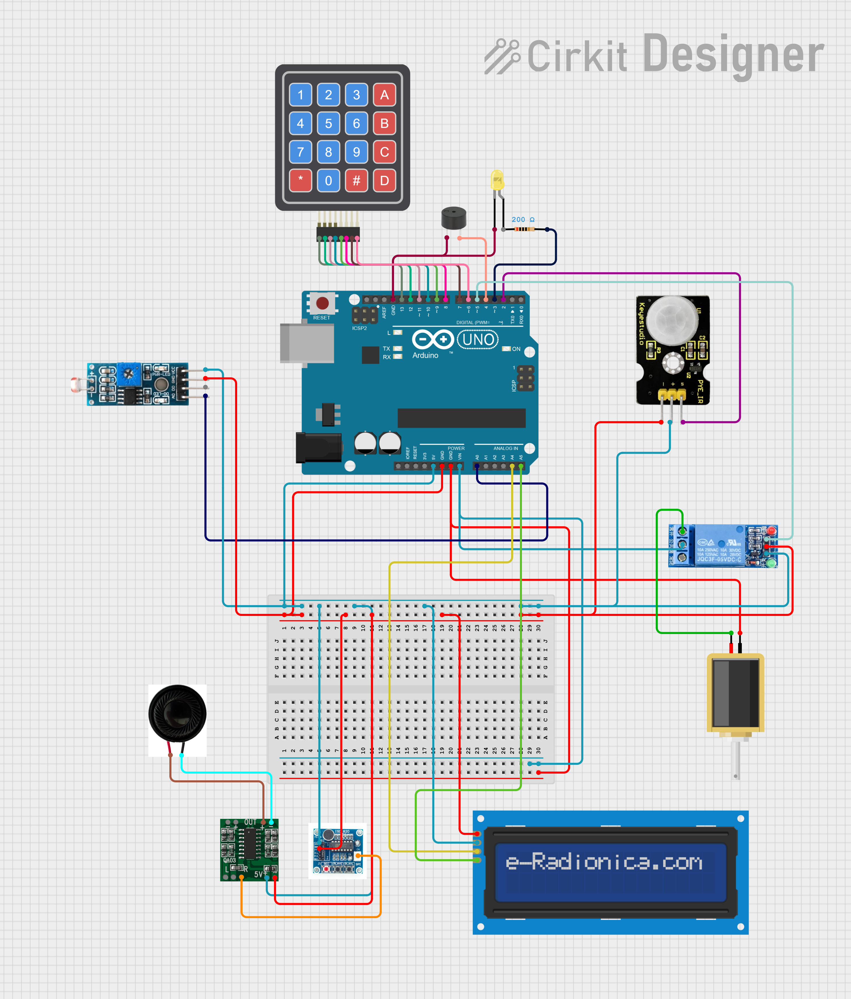

# Voice assisted lock system with Face recognition
This project develops an advanced face recognition system using Haar Cascade classifiers, enabling an Arduino-controlled automatic locking mechanism that enhances security and streamlines access for authorized users. It includes features like motion-triggered LED lighting, dynamic One-Time Password (OTP) generation for added verification, and a voice module for audio guidance, significantly improving both security and user-friendliness.
## Features
👁️‍🗨️ Face recognition using Haar Cascade 
🎤 Voice module (ISD1820) for audio guidance 
🔐 Automated locking mechanism using solenoid and relay 
📱 OTP generation via API to registered mobile devices 
🌙 Automatic LED lighting using LDR and PIR sensors 
🔢 Keypad and LCD module for OTP entry and user feedback 

## ⚙️ How It Works
- <u>Activation</u> : The system activates upon detecting motion
- <u>Face Scan</u>: CAM captures and compares the face using Haar Cascade.
- <u>Authentication</u>: If the face matches a registered user: the solenoid lock unlocks
- <u>OTP Verification</u>: An OTP is sent to the user's mobile via API.
- <u>OTP Entry</u>: The user enters the OTP on the keypad.
- <u>Access Granted</u>: On valid OTP, the door unlocks via solenoid control.
- <u>Lighting</u>: If ambient light is low and motion is detected, LEDs automatically turn on.
- <u>Voice Feedback</u>: ISD1820 provides guidance messages for visitors.

## 🛠️ Hardware Setup

## Steps to Execute